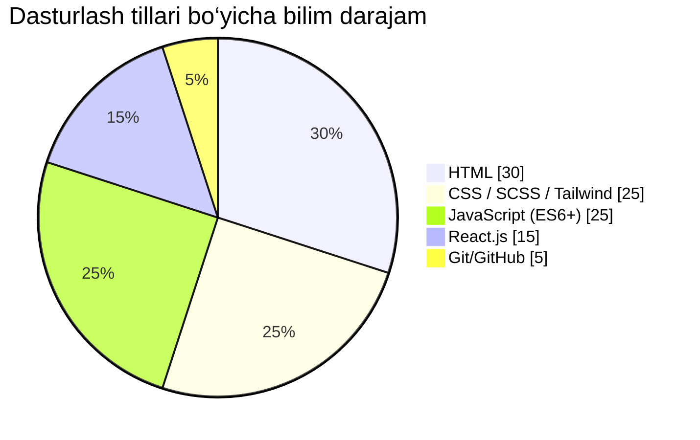

<!-- PROFIL UCHUN README -->

<p align="center">
  
</p>

<p align="center">
  
</p>

---

## 🧠 Men kimman?

```yaml
Ism: AslDeveloper07
Yo‘nalish: Frontend Developer
Joylashuv: O‘zbekiston
Texnologiyalar: HTML, CSS, JavaScript, React.js, Sass, Tailwind
Hozir o‘rganayotganim: GSAP, Framer Motion, REST API
```

---

## 🛠️ Biladigan texnologiyalarim:


---

## 📊 Kod yozishdagi foizlarim:



---

## 🔥 GitHub statistikalarim

<p align="center">
  
  
</p>

---

## 🧩 Asosiy loyihalarim:

| Loyiha nomi | Texnologiyalar | Link |
|------------|----------------|------|
| `SignIn` | HTML, CSS, JS | [Repo](https://github.com/Iqboljon-Developer07/SignIn) |
| `3D Card Design` | HTML, CSS, GSAP | [Repo](https://github.com/Iqboljon-Developer07/Card-3D) |
| `GSAP Animation` | React, GSAP | [Repo](https://github.com/Iqboljon-Developer07/GSAP-Animate) |
| `UzumMarket` | Swiper, Tailwind | [Repo](https://github.com/Iqboljon-Developer07/UzumMarket) |

---

## 📷 Galereya

<p align="center">
  
  
</p>

---

## 📚 O‘rganayotgan texnologiyalar

- Framer Motion
- Next.js
- GSAP
- LocalStorage & API Fetch
- React Hooks (useState, useEffect)

---

## 📝 Hayotiy shiorim:

> "Bugun bitta tugma bosish – ertaga milliardlab foydalanuvchi uchun qulaylik yaratadi."

---

## 📫 Aloqa:

- Telegram: [@AslDeveloper07](https://t.me/AslDeveloper07)
- Email: asl.developer07@gmail.com
- Portfolio: [asldeveloper07.github.io](https://asldeveloper07.github.io)

---

## 🧠 Qiziqishlar:

- 🧩 Puzzle yechish
- 🧬 Murakkab loyihalarda ishlash
- 📈 Frontend dizayn evolyutsiyasi
- 🎨 Figma’dan kodga responsive saytlarga o‘tish

---

## 🧠 Mening GitHub safarim:

```text
📌 2023: Frontend asoslari
📌 2024: React, komponent tizimi
📌 2025: Framer Motion, REST API, loyihalar bilan kengayish
```

---

## 🏆 Github'dagi ba'zi yutuqlarim:

- ⭐ HTML bo‘yicha 36 ta yulduz (top 23k devs)
- 15+ ommaviy repo
- 500+ commit
- Har oy yangi loyiha

---

## 📁 GitHub aktivlik grafigi:


---

## 🙌 Rahmat!

Agar mening loyihalarim sizga yoqqan bo‘lsa, ⭐ bosing, follow qiling va fikr qoldiring!

---
