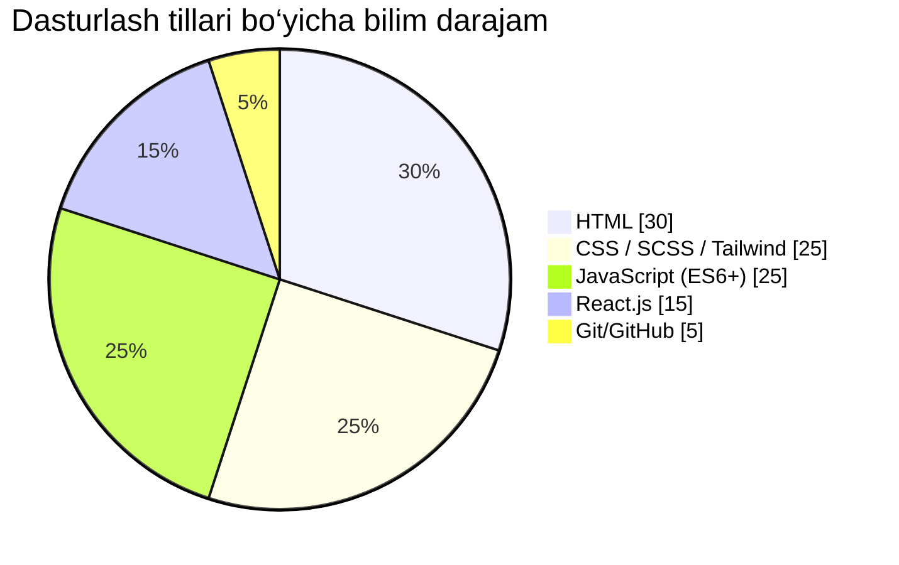

<!-- 🚀 FUTURE READY - GITHUB PROFILE README for AslDeveloper07 -->

<h1 align="center">
  
</h1>

<p align="center">
  
</p>

---

## 🌌 ABOUT ME

```yaml
Username: AslDeveloper07
Role: Futuristic Frontend Developer
Location: Uzbekistan, Earth-5000
Skills: HTML • CSS • JS • React • Tailwind • GSAP • SCSS • Git
Learning: Framer Motion, Next.js, AI-integrated UI Systems
```
---

## 🧠 TECH STACK

<p align="center">
  
</p>

---

## 🔮 TECHNOLOGY MASTERY



---

## 🧠 MY MISSION

> “I am not coding for today, I’m building interfaces for the future.”  
> “Har bir komponent — bu kelajak foydalanuvchisiga sovg‘a!”

---

## 📈 GITHUB STATS

<p align="center">
  
  
</p>

---

## 🌐 LIVE PROJECTS

| 🚀 Project | 💻 Technologies | 🔗 Demo |
|-----------|----------------|---------|
| **SignIn System** | HTML, CSS, JS | [🔗 View](https://github.com/Iqboljon-Developer07/SignIn) |
| **3D Animated Card** | HTML, CSS, GSAP | [🔗 View](https://github.com/Iqboljon-Developer07/Card-3D) |
| **GSAP Animations** | React, GSAP | [🔗 View](https://github.com/Iqboljon-Developer07/GSAP-Animate) |
| **UzumMarket Clone** | Tailwind, SwiperJS | [🔗 View](https://github.com/Iqboljon-Developer07/UzumMarket) |

---

## 🖼️ PROJECT GALLERY

<p align="center">
  
  
</p>

---

## 🚀 ACTIVITIES


---

## 🧬 LEARNING & INNOVATION

- 📦 Component-based architectures (React, Vite)
- 🧠 Framer Motion & GSAP for futuristic UI
- 📲 Responsive design for foldable screens
- 🧠 Building with performance-first mindset
- 🪐 Creative CSS & pixel-perfect layouts

---

## 🎯 GOALS OF THE YEAR 5000

- [x] Build blazing-fast frontend apps ⚡
- [x] Master animation techniques 🎞️
- [ ] Launch personal design system 💠
- [ ] Open-source my futuristic components 🚀

---

## 📡 LET’S CONNECT

<p align="center">
  <a href="mailto:asl.developer07@gmail.com"></a>
  <a href="https://t.me/AslDeveloper07"></a>
  <a href="https://github.com/AslDeveloper07"></a>
</p>

---

## 🙏 THANK YOU

> ⭐ Berish – bu kichik harakat, lekin ulkan motivatsiya.
> Mening ishlarim sizga foydali bo‘lsa, like bosing va fikr bildiring.

---

<!-- END OF 5000-YEAR FUTURISTIC PROFILE README -->

